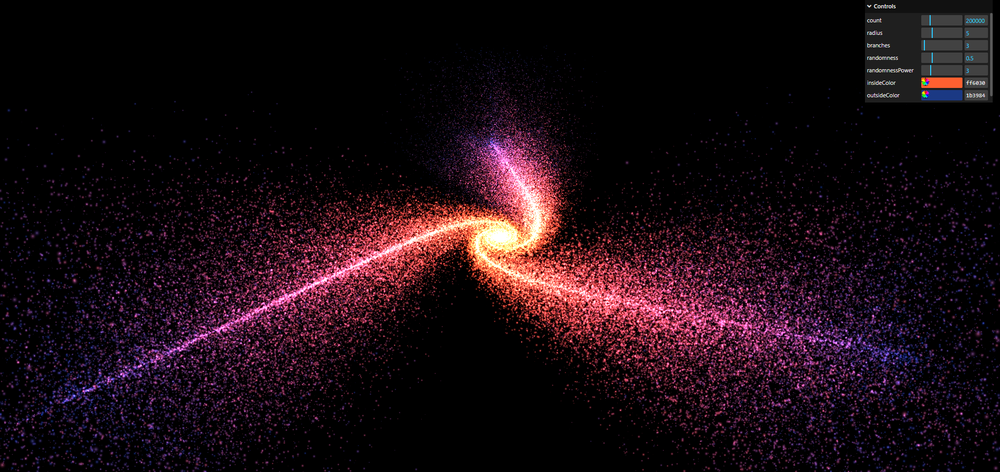

# Three.js Journey

# Animated Galaxy Visualization with Three.js

This project is an artistic representation of a galaxy using Three.js, which is a robust JavaScript library and API that enables the creation and display of animated 3D graphics in a web browser through WebGL.

## Features

- Dynamic galaxy generation with customizable parameters
- Interactive camera controls with OrbitControls
- Shader-based star rendering for a stunning visual effect
- Responsive design to accommodate various display sizes

## Setup
Download [Node.js](https://nodejs.org/en/download/).
Run this followed commands:

``` bash
# Install dependencies (only the first time)
npm install

# Run the local server at localhost:8080
npm run dev

# Build for production in the dist/ directory
npm run build
```
## Demo

You can view a live demonstration of the Animated Galaxy Visualization by visiting the following link:

[](assets/video.mp4)
